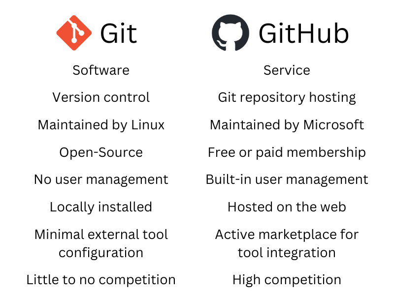
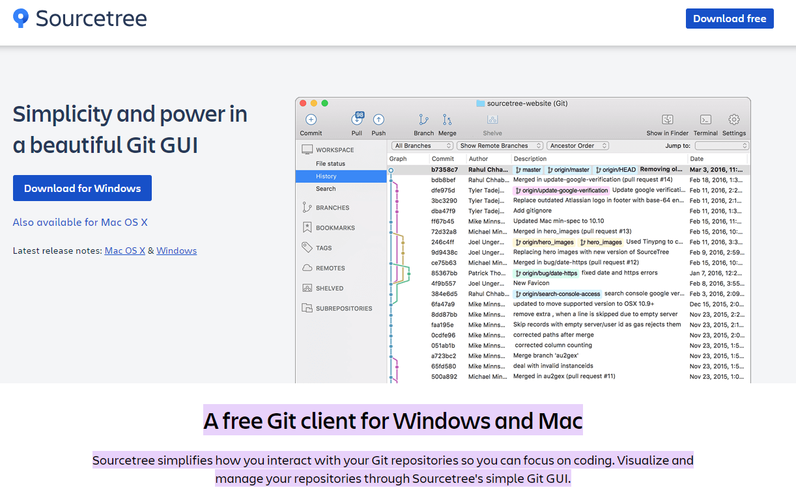
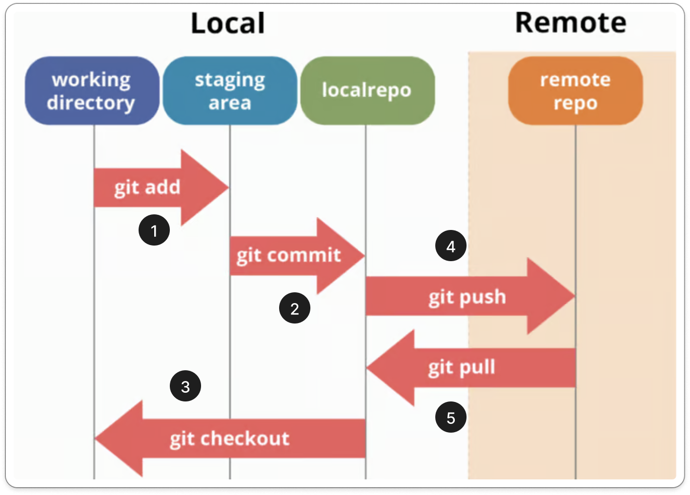

# Introduction

## GIT vs GitHub


https://levelup.gitconnected.com/git-vs-github-synonyms-competitors-or-different-technologies-9a66e480feec

## Sourcetree


https://medium.com/@james.r.interns/why-you-should-use-sourcetree-1bc8814c32b6

## GIT workflow


https://dev.to/mollynem/git-github--workflow-fundamentals-5496

#### 0. Initialize Git
```
git init
```

#### 1. Add files to staging area
```
git add [file_name]
git add .
git add --all
git add -A
```
```
file status

    U - Untracked files
    A - Files added to stage
    M - Modified files
    D - Deleted files
```

#### 2. Commit code to local repository
```
git commit -m "[COMMIT_MESSAGE]"
```
```
git log
```

#### 3. Branch & Checkout

- List branch in local repository
    ```
    git branch
    ```

 - New GIT branch
    ```
    git branch [NEW_BRANCH_NAME]
    git checkout [NEW_BRANCH_NAME]
    ```

- Switching between branches
    ```
    git checkout [EXIST_BRANCH_NAME]
    ```

- Delete branch
    ```
    git branch -d [EXIST_BRANCH_NAME]
    git push origin --delete [EXIST_BRANCH_NAME]
    ```

- Merge branch (from [TARGET_BRANCH] to [BASE_BRANCH])
    ```
    git checkout [BASE_BRANCH]
    git merge [TARGET_BRANCH]
    ```

#### 4. Push branch to remote repository
    ```
    git push [alias] [EXIST_BRANCH_NAME]
    git push origin main
    ```

#### 5. Pull brnch to update local branch repository
    ```
    git checkout [EXIST_BRANCH_NAME]
    git pull
    ```


---

### GIT CHEAT SHEET
https://education.github.com/git-cheat-sheet-education.pdf