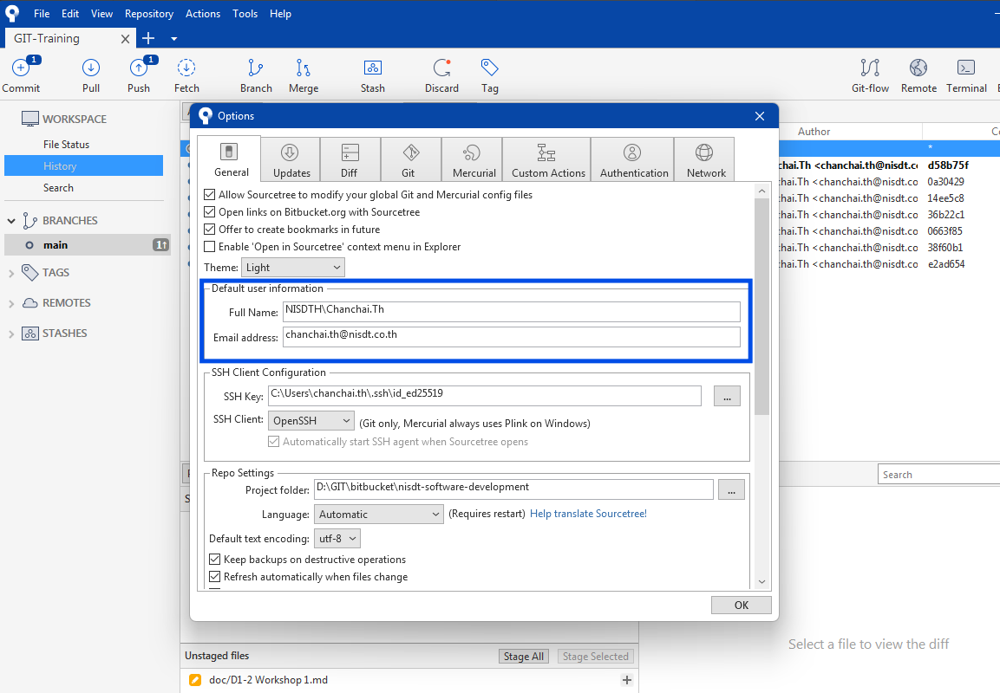
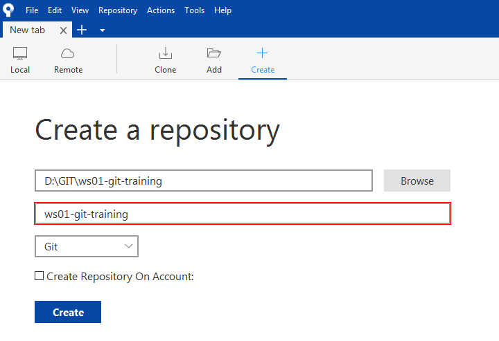

# Workshop #1 - Local GIT

### Configure Git
```
git config --global user.name "[YOUR_NAME]"
git config --global user.email "[YOUR_EMAIL]"
```



---

### New local repository

0. Create code directory
    ```
    ...\GIT
    ```

1. New repository
    - Open **Sourcetree** 
    - Select `Create a repository`
    - Destination path `...\GIT\ws01-git-training`
    - Name `ws01-git-training`
    - Type `Git`

    

### How to add files to staging area & commit files

2. Writing your code
    - Open **Visual Studio Code** and browse to `\GIT\ws01-git-training`
    - Create `index.html` (tip: use `!` to generate HTML)
        ```html
        <!DOCTYPE html>
        <html lang="en">
        <head>
            <meta charset="UTF-8">
            <meta name="viewport" content="width=device-width, initial-scale=1.0">
            <title>Document</title>
        </head>
        <body>
            
        </body>
        </html>
        ```

3. Add your code to staging area
    - Goto **Sourcetree**
    - Navigate to `Workspace > File Status`
    - Press `Stage All` button

4. Commit to repository
    - Input commit message
    - Press `Commit` button

5. Edit `index.html` as following
    ```html
    <!DOCTYPE html>
    <html lang="en">
    <head>
        <meta charset="UTF-8">
        <meta name="viewport" content="width=device-width, initial-scale=1.0">
        <title>Index</title>
    </head>
    <body>
        <h1>Hello GIT</h1>
        <p>This is the first file in my new Git Repo.</p>

    </body>
    </html>
    ```
6. Add file to staging area and commit change

7. New file `script.js`
    ```javascript
    const msgSpan = document.getElementById('msg');
    msgSpan.textContent = "This message from script.js";
    ```

8. Update `index.html` as following
    ```html
    <!DOCTYPE html>
    <html lang="en">
    <head>
        <meta charset="UTF-8">
        <meta name="viewport" content="width=device-width, initial-scale=1.0">
        <title>Index</title>
    </head>
    <body>
        <h1>Hello GIT</h1>
        <p>This is the first file in my new Git Repo.</p>

        <span id="msg"></span>

        <script src="script.js"></script>
    </body>
    </html>
    ```

9. Add file to staging area and commit change

### Work with branch & merge

10. Create new branch `feature_style` from latest commit, than switch to this branch

11. New file `style.css`
    ```css
    body {
        font-family: Arial, sans-serif;
        background-color: #f0f0f0;
        margin: 0;
        padding: 20px;
    }

    h1 {
        color: #333;
    }

    p {
        font-size: 18px;
        color: #666;
    }

    #msg {
        display: block;
        margin-top: 20px;
        font-weight: bold;
        color: #007bff;
    }
    ```

12. Update `index.html` as following
    ```html
    <!DOCTYPE html>
    <html lang="en">
    <head>
        <meta charset="UTF-8" />
        <meta name="viewport" content="width=device-width, initial-scale=1.0" />
        <title>Index</title>
        <link rel="stylesheet" href="style.css" />
    </head>
    <body>
        <h1>Hello GIT</h1>
        <p>This is the first file in my new Git Repo.</p>

        <span id="msg"></span>

        <script src="script.js"></script>
    </body>
    </html>
    ```

13. Add file to staging area and commit change

14. Update `style.css` by increase font-size to 20px as following
    ```css
    body {
    font-family: Arial, sans-serif;
    background-color: #f0f0f0;
    margin: 0;
    padding: 20px;
    }

    h1 {
    color: #0219c7;
    }

    p {
    font-size: 20px;
    color: #666;
    }

    #msg {
    display: block;
    margin-top: 20px;
    font-weight: bold;
    color: #007bff;
    }
    ```

15. Add file to staging area and commit change

16. Checkout `main` branch

17. Merge branch `feature_style` into `main`
    - This case `main` has no change

18. Checkout `feature_style` branch

19. Update `style.css` by add `text-align: center;` into `body` as following
    ```css
    body {
    font-family: Arial, sans-serif;
    background-color: #f0f0f0;
    margin: 0;
    padding: 20px;
    text-align: center;
    }

    h1 {
    color: #0219c7;
    }

    p {
    font-size: 20px;
    color: #666;
    }

    #msg {
    display: block;
    margin-top: 20px;
    font-weight: bold;
    color: #007bff;
    }
    ```

20. Add file to staging area and commit change

21. Checkout `main` branch

22. Update `index.html` by add `<hr>` and `<h3>` tag as following
    ```html
    <!DOCTYPE html>
    <html lang="en">
    <head>
        <meta charset="UTF-8" />
        <meta name="viewport" content="width=device-width, initial-scale=1.0" />
        <title>Index</title>
        <link rel="stylesheet" href="style.css" />
    </head>
    <body>
        <h1>Hello GIT</h1>
        <p>This is the first file in my new Git Repo.</p>

        <span id="msg"></span>

        <hr />

        <h3>This message from main branch</h3>

        <script src="script.js"></script>
    </body>
    </html>
    ```

23. Add file to staging area and commit change

24. Merge branch `feature_style` into `main`
    - This case `main` have change

25. (optional) Merge branch `main` into `feature_style`
    -  To make `feature_style` branch up to date
