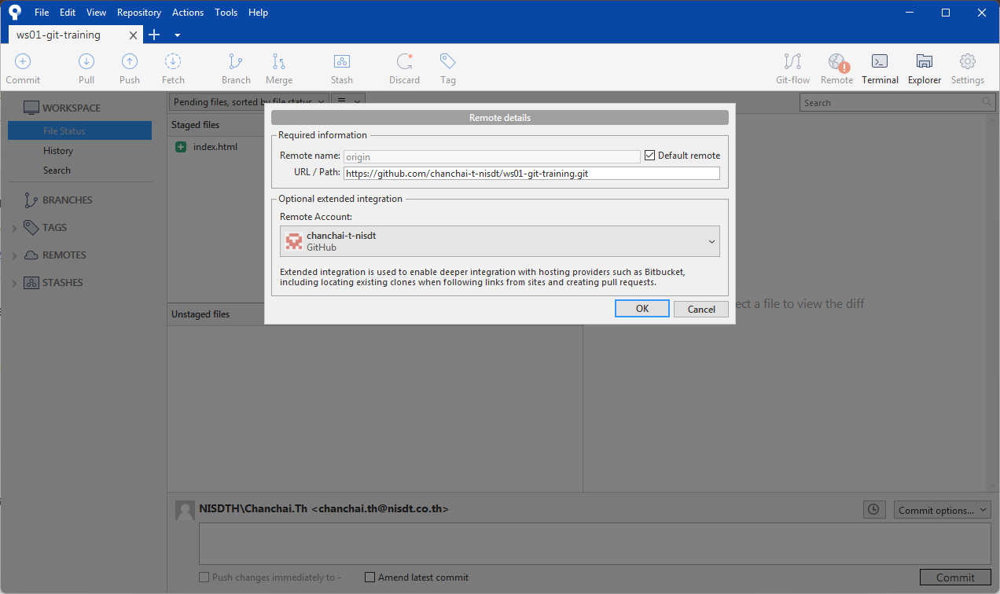

# Workshop #2 - Remote GIT

### New local repository

1. New repository name `ws01-git-training`
    - Private repository
    - No need a README file

### Add remote path to local repository
2. Copy remote URL e.g. `https://github.com/xxx/ws01-git-training.git`
    - Use HTTPS protocal
3. Open `ws01-git-training` local repository in Sourcetree
4. Add new repository path
    - name `origin`
    - path `https://github.com/xxx/ws01-git-training.git`



### Push & Pull

5. (optional) If `main` branch not exist, rename `master` to `main` branch is required
6. Push `main` branch to remote
7. Checkout `main` branch and update `index.html` then commit as following
    ```html
    <!DOCTYPE html>
    <html lang="en">
    <head>
        <meta charset="UTF-8" />
        <meta name="viewport" content="width=device-width, initial-scale=1.0" />
        <title>Index</title>
        <link rel="stylesheet" href="style.css" />
    </head>
    <body>
        <h1>Hello GIT</h1>
        <p>This is the first file in my new Git Repo.</p>

        <span id="msg"></span>

        <hr />

        <h3>This message from main branch</h3>

        <h4>
        GIT push : to upload your local repository content to a remote repository
        </h4>

        <h4>
        Git pull : to update your local repository with the latest changes from a
        remote repository
        </h4>

        <script src="script.js"></script>
    </body>
    </html>
    ```
8. Push `main` branch to remote
9. In GitHub, Add `README.md` file, than commit change
    ```markdown
    # ws01-git-training

    #### This is repository to learn about GIT
    ```
10. In Sourcetree, pull `main` branch from remote to update the branch
    - Use `Fetch` to check what is new
    - Use `Merge` to merge the remote to local branch
    - Use `Pull` to `Fetch` then `Merge` in single action