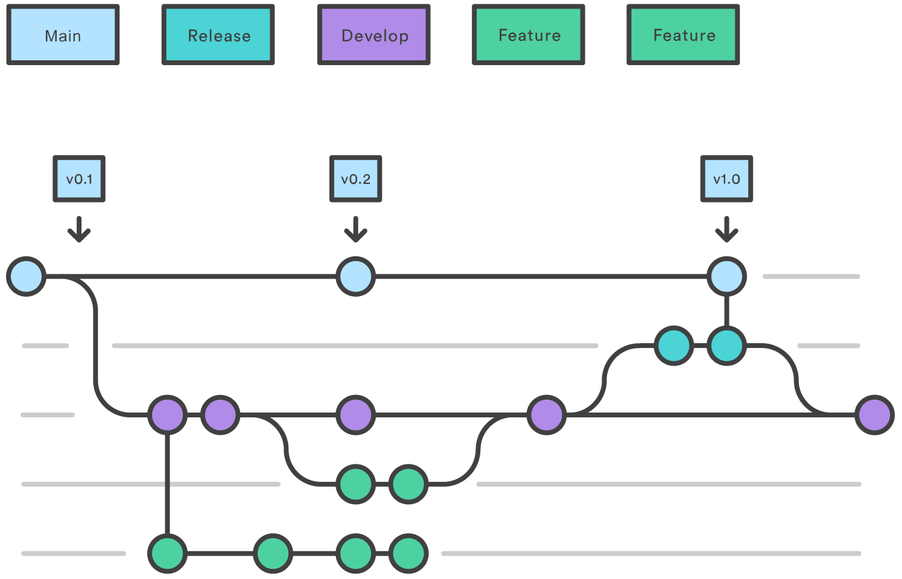
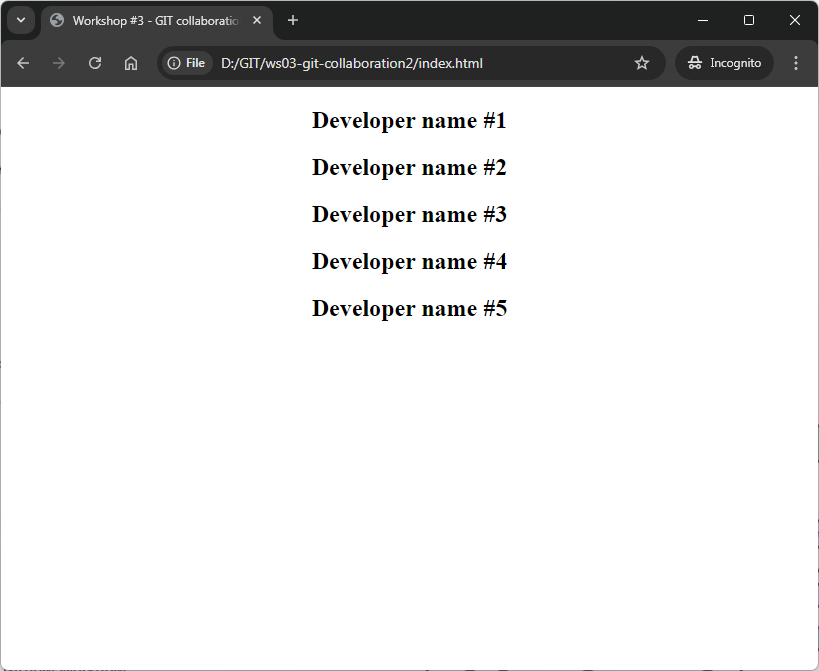
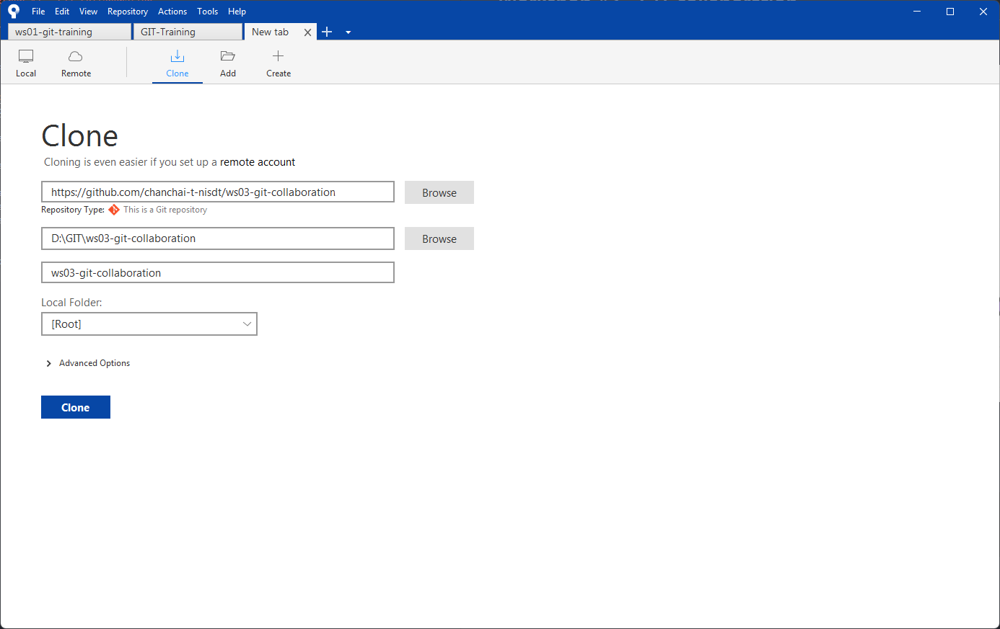
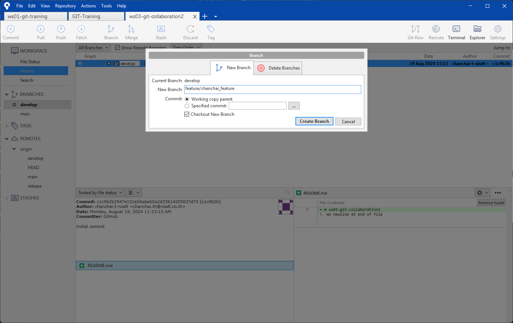
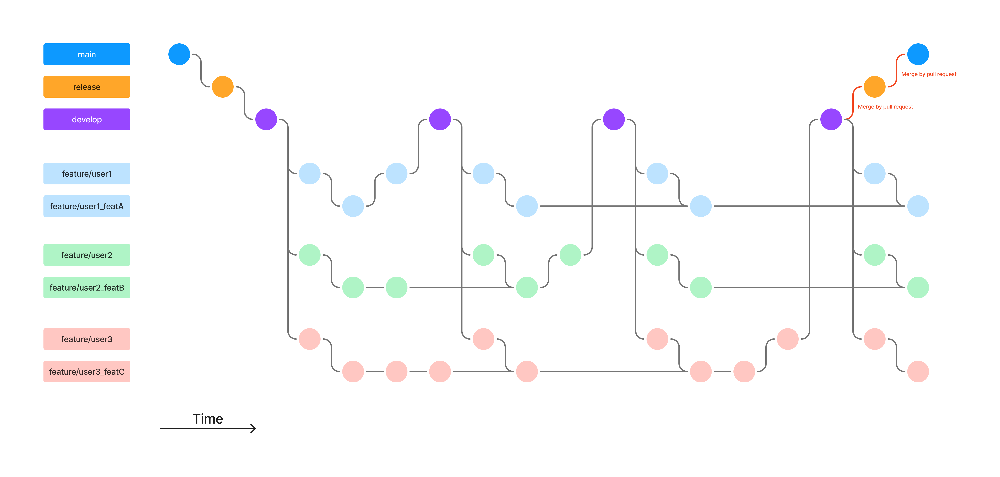

# Workshop #3 - GIT collaboration

### Branch workflow



https://www.atlassian.com/git/tutorials/comparing-workflows/gitflow-workflow

---

### Output



### Create repository

0. Create remote repository `ws03-git-collaboration` in shared organization

### Prepare branches

1. Create branch as following in remote repository
    ```
    main
    develop
    release
    ```

2. Clone `ws03-git-collaboration` repository by Souretree

    

3. Checkout `develop` branch and crete your own branch
    ```
    feature/[YOURNAME]_feature
    ```

    

4. Push `feature/[YOURNAME]_feature` branch to remote

5. (All dev) Create and checkout new branch `feature/[YOURNAME]_feature_myname` from  `feature/[YOURNAME]_feature`

6. (dev #1) New/Edit file `index.html`
    ```html
    <!DOCTYPE html>
    <html lang="en">
    <head>
        <meta charset="UTF-8" />
        <meta name="viewport" content="width=device-width, initial-scale=1.0" />
        <title>Workshop #3 - GIT collaboration</title>
    </head>
    <body style="text-align: center">
        <!-- Add span tag here -->
        <h2 id="chanchai-span1"></h2>

        <!-- Add ref. script here -->
        <script src="chanchai.js"></script>
    </body>
    </html>
    ```

7. (All dev) New file `[YOUR_NAME].js`
    ```javascript
    const msgSpan = document.getElementById('chanchai-span1');
    msgSpan.textContent = "Chanchai Thaiyanon";
    ```

8. (dev #1) Add to staging area and commit change

9. (dev #1) Merge branch from `feature/[YOURNAME]_feature_myname` to `feature/[YOURNAME]_feature`

10. (dev #1) Merge branch from `feature/[YOURNAME]_feature` to `develop`

11. (dev #1) Push branch to remote
    ```
    1.feature/[YOURNAME]_feature
    2.develop
    ```

11. (All dev) Fetch & Pull `develop` to local repository

12. (All dev) Merge branch from `develop` to `feature/[YOURNAME]_feature`

13. Next dev, Repeat 6-12

14. When all develper done, pull request from `develop` to `release`

15. Pull request from `release` to `main`


---


